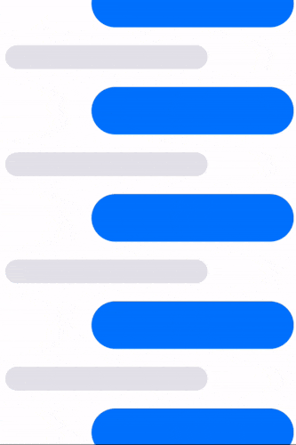

# scrollbounce

<a href="">

</a>

[](https://bundlephobia.com/result?p=scrollbounce)
[](https://npmjs.org/package/scrollbounce "View this project on npm")

## Quickstart

`npm install scrollbounce`

or

`yarn add scrollbounce`

### 1. Give animated elements unique `data-bounce-id` attributes:

```html
<ul>
  <li data-bounce-id="1"></li>
  <li data-bounce-id="2"></li>
  <li data-bounce-id="3"></li>
</ul>
```

### 2. Init the animation:

```js
const unlisten = initScrollBounce()

// if you want to remove the effect later:
unlisten()
```

## Options

The default effect is pretty subtle. To crank it up you can pass in an `effectMultiplier` option.

```js
initScrollBounce({ effectMultiplier: 3 })
```

## Coming soon

- [ ] Improved edge case handling
- [ ] Performance optimizations
- [ ] More spring customization
- [ ] Support horizontal scroll

## Details

- [Inspired by the "BouncyLayout" library for iOS ](https://github.com/roberthein/BouncyLayout)
- This library is targeted towards touch devices and won't have any effect on desktop.
